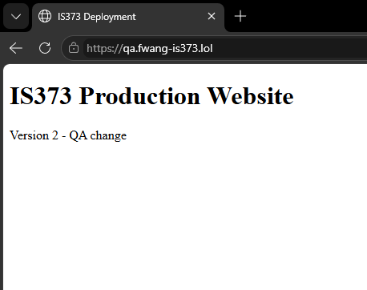
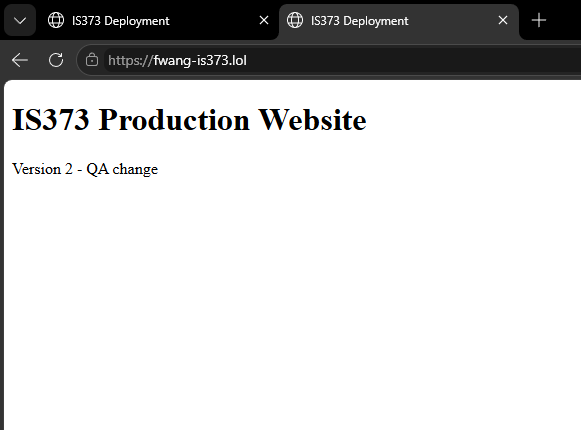
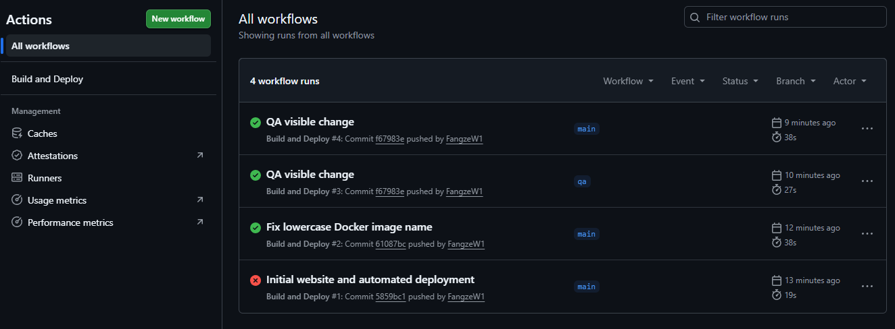
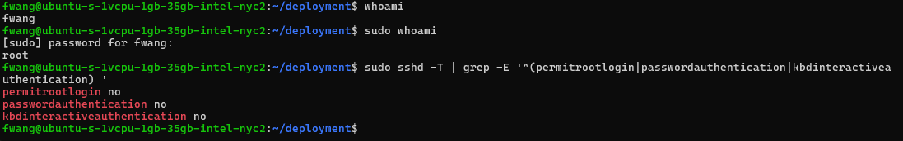
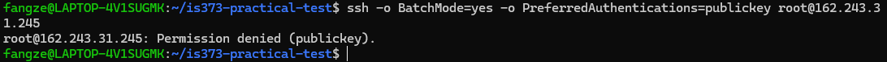

# IS373 Practical Test

## Project Overview

This project demonstrates automated website deployment using Docker, GitHub Actions, GitHub Container Registry (GHCR), Traefik, and a DigitalOcean Ubuntu server.

The project includes separate QA and production environments, automated CI/CD, HTTPS certificates, and SSH security hardening.

## Live Websites

- **Production:** https://fwang-is373.lol
- **QA:** https://qa.fwang-is373.lol

Both websites use HTTPS certificates issued by Let's Encrypt.

## CI/CD Pipeline

The GitHub Actions workflow automatically performs the following steps whenever code is pushed to the `qa` or `main` branch:

1. Checks out the repository.
2. Validates the website and Docker Compose configuration.
3. Builds a Docker image.
4. Pushes the image to GitHub Container Registry.
5. Connects to the DigitalOcean server using SSH credentials stored in GitHub Actions secrets.
6. Pulls the updated image and redeploys the corresponding Docker container.

Failed validation or image builds prevent deployment.

Changes pushed to `qa` deploy to the QA website. Changes pushed to `main` deploy to production.

## Test Evidence

### Successful GitHub Actions Runs

**QA deployment (Run #3):**

https://github.com/FangzeW1/is373-practical-test/actions/runs/37819665336

**Production deployment (Run #4):**

https://github.com/FangzeW1/is373-practical-test/actions/runs/37819784619

### Docker Image Registry

https://github.com/FangzeW1/is373-practical-test/pkgs/container/is373-practical-test

**Docker images:**
- `ghcr.io/fangzew1/is373-practical-test:qa`
- `ghcr.io/fangzew1/is373-practical-test:main`

**Deployed commit:** `f67983e`

## QA to Production Promotion

A visible website change was deployed to the QA environment first, changing the website to Version 2.

The QA workflow (Run #3) completed successfully before the production workflow (Run #4).

The change was then promoted to the `main` branch and automatically deployed to production.

Both environments now display Version 2.

## Server Security

The DigitalOcean server runs Ubuntu and uses a non-root administrator account named `fwang`.

Security measures include:

- SSH public key authentication.
- Root SSH login disabled.
- Password SSH authentication disabled.
- UFW firewall configured for SSH, HTTP, and HTTPS.
- Fail2ban enabled for SSH protection.
- Automatic security updates enabled.
- Docker containers configured with reduced privileges.
- HTTPS provided by Traefik and Let's Encrypt.

The SSH configuration was verified using `sshd -T`. A root SSH login attempt was also rejected.

## Screenshots and Verification

### QA Website

### Production Website

### Successful GitHub Actions Workflows

### SSH Security Configuration

### Root SSH Login Rejected

## Technologies Used

- DigitalOcean
- Ubuntu Linux
- Docker and Docker Compose
- Nginx
- Traefik
- Let's Encrypt
- GitHub Actions
- GitHub Container Registry
- Git and GitHub
